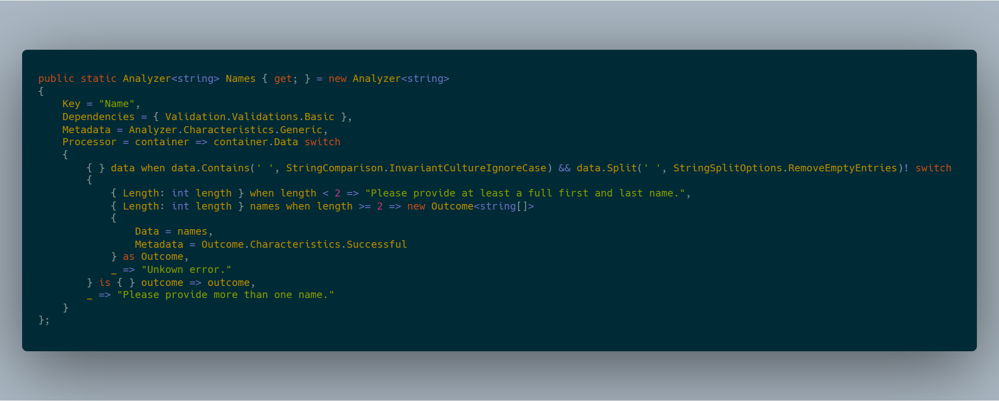

# Strikeout Validation Engine

Strikeout is a validation engine library written in C# 8, targeting .NET Standard 2.1. It aims to make validating data easy, even when used in non-trivial situations.

## Contributions

This project welcomes and appreciates contributions.

## License

This project and it's source is provided under the [MIT license](LICENSE.txt).